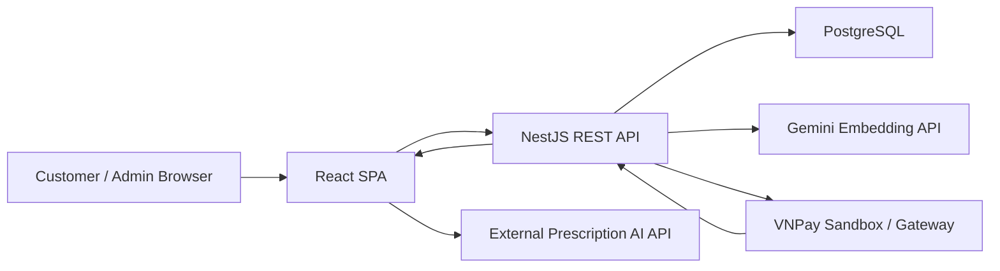

# PBL7 Medicine E-Commerce Platform

Full-stack pharmacy e-commerce platform built for online medicine discovery, cart management, order checkout, payment processing, prescription-assisted cart import, and administrator operations.

The project is organized as two applications:

- **Backend**: NestJS REST API, TypeORM, PostgreSQL, JWT authentication, RBAC, migrations, seed scripts, VNPay integration, and semantic medicine search.
- **Frontend**: React 17 single-page application with customer storefront, authentication, product browsing, cart/checkout, VNPay return handling, consultation flows, and admin dashboard.

## Table of Contents

- [Project Overview](#project-overview)
- [Key Features](#key-features)
- [Architecture](#architecture)
- [Technology Stack](#technology-stack)
- [Repository Structure](#repository-structure)
- [Backend Design](#backend-design)
- [Frontend Design](#frontend-design)
- [Database Model](#database-model)
- [API Overview](#api-overview)
- [Environment Variables](#environment-variables)
- [Getting Started](#getting-started)
- [Database Seeding and Search Indexing](#database-seeding-and-search-indexing)
- [Testing](#testing)
- [Production Notes](#production-notes)
- [Engineering Highlights](#engineering-highlights)

## Project Overview

PBL7 Medicine E-Commerce Platform simulates a professional online pharmacy workflow. Customers can browse medicines by category, search products, view medicine details, manage carts, choose delivery addresses, create orders, and pay via COD or VNPay. The system also supports prescription image extraction through an external AI endpoint, then maps extracted medicines to catalog items and imports matched products into the cart.

Administrators can manage users, orders, consultations, customer messages, and business statistics such as revenue, paid order ratio, and top-selling products.

## Key Features

### Customer

- Account registration and login using email/password.
- Google sign-in through Google Identity Services and backend token exchange.
- JWT-based authenticated sessions with automatic token-expiration handling.
- Medicine listing, category browsing, product detail pages, and paginated search.
- Hybrid medicine search using lexical matching, semantic embeddings, and reranking.
- Cart management with product, unit, quantity, and price snapshot support.
- Prescription image upload and AI-assisted medicine extraction.
- Automatic import of valid prescription items into the cart.
- Delivery address management.
- Checkout flow with reusable pending-order state for retry-safe payment.
- COD and VNPay payment initiation.
- VNPay return handling and order/payment status confirmation.
- Personal order history and profile page.

### Administrator

- Role-protected admin routes.
- Order listing, order details, and order management.
- Customer/user management.
- Doctor/consultation message management.
- Admin dashboard with revenue, order status, paid rate, customer count, and top products.
- Message tracking for unreplied consultation requests.

### Platform

- Standardized API response envelope.
- Global exception handling with trace IDs.
- DTO validation with whitelisting and non-whitelisted-field rejection.
- Role-based access control for admin-only capabilities.
- TypeORM migrations with `synchronize: false`.
- PostgreSQL persistence with normalized catalog, cart, order, payment, and user-address models.
- Seed scripts for product, category, unit, and medicine data.
- Optional Gemini embedding-powered semantic search.

## Architecture



### Request Flow

1. The React SPA calls the NestJS API through a centralized API client.
2. Authenticated requests attach a Bearer token from local storage.
3. The backend validates DTOs globally and wraps successful responses in a common envelope.
4. Exceptions are normalized by a global exception filter and include a trace ID.
5. Transaction-sensitive workflows such as checkout and payment use TypeORM transactions and pessimistic locks where needed.
6. VNPay payment confirmation validates secure hash data before updating payment and order status.

## Technology Stack

### Backend

- **Runtime**: Node.js
- **Framework**: NestJS 11
- **Language**: TypeScript
- **Database**: PostgreSQL
- **ORM**: TypeORM 0.3
- **Authentication**: Passport JWT, Google ID token verification
- **Validation**: class-validator, class-transformer
- **Security**: bcrypt, JWT, role guards
- **Payment**: COD and VNPay
- **AI/Search**: Gemini Embeddings, PostgreSQL vector search, lexical reranking
- **Testing**: Jest, Supertest
- **Quality**: ESLint, Prettier

### Frontend

- **Framework**: React 17
- **Routing**: react-router-dom v5
- **Styling**: Tailwind CSS via CRACO
- **State**: React Context and custom hooks
- **Auth UX**: Backend JWT session, Google Identity Services
- **UI Utilities**: react-icons, sweetalert, swiper
- **Testing**: React Testing Library, Playwright
- **Deployment Config**: Firebase Hosting config

## Repository Structure

```text
backend
├── src
│   ├── common
│   │   ├── constants
│   │   ├── decorators
│   │   ├── filters
│   │   ├── guards
│   │   ├── interceptors
│   │   ├── interfaces
│   │   └── utils
│   ├── configs
│   ├── database
│   │   └── migrations
│   └── modules
│       ├── auth
│       ├── cart
│       ├── cartitem
│       ├── category
│       ├── chat
│       ├── doctor
│       ├── medicine
│       ├── order
│       ├── orderitem
│       ├── payment
│       └── user
├── scripts
├── data
├── test
└── uploads
```

The frontend source is maintained on the `FE` branch/worktree and follows this structure:

```text
src
├── components
│   ├── Admin
│   ├── ChatButton
│   ├── Contact
│   ├── Form
│   ├── Header
│   ├── Navbar
│   ├── Order
│   ├── Services
│   ├── Testimonial
│   └── products
├── contexts
├── hooks
├── routes
├── screens
├── styles
└── utils
tests
└── playwright
```

## Backend Design

### Application Bootstrap

The backend initializes the application through `AppModule`, loading configuration globally and connecting TypeORM asynchronously through `ConfigService`.

Global backend policies include:

- CORS allowlist for local development and deployed frontend origin.
- Global `ValidationPipe` with `whitelist`, `forbidNonWhitelisted`, and `transform`.
- `ClassSerializerInterceptor` for response serialization.
- `GlobalExceptionFilter` for normalized errors.
- `ApiResponseInterceptor` for consistent success responses.
- Static serving for uploaded files under `/uploads`.

### Modules

| Module | Responsibility |
| --- | --- |
| `auth` | Email/password login, Google login, JWT generation and strategies |
| `user` | User CRUD, profile updates, admin user management, address book |
| `medicine` | Catalog listing, detail lookup, pricing units, search, semantic search |
| `category` | Category tree, category CRUD, category product listing |
| `cart` | User cart summary, add/remove/clear items, prescription import |
| `cartitem` | Cart item CRUD support |
| `order` | Checkout, order listing, order details, admin order operations |
| `orderitem` | Order item persistence and CRUD support |
| `payment` | COD, VNPay initiation, VNPay return/IPN confirmation, payment status |
| `doctor` | Patient messages and admin/doctor replies |
| `chat` | Chat/consultation API entry point |

### Search Design

Medicine search combines:

- lexical candidate selection over normalized searchable text,
- semantic candidate retrieval through Gemini-generated embeddings,
- vector similarity ordering using PostgreSQL vector distance,
- reranking based on product name, slug, search text, match type, and semantic score,
- query embedding cache to avoid repeated embedding requests.

This gives the product catalog a more realistic search experience than simple string filtering.

### Payment Design

The payment module supports:

- COD order payment creation with pending collection status,
- VNPay gateway payment URL generation,
- VNPay return/IPN secure hash validation,
- transaction-safe payment confirmation,
- order status transition from `PENDING` to `PAID`,
- failed/pending payment handling,
- frontend return URL generation for SPA routing.

## Frontend Design

The frontend is a React SPA organized around screens, reusable components, route guards, context providers, and API utilities.

### Routing

Core routes include:

| Route | Purpose |
| --- | --- |
| `/` | Home page |
| `/products` | Product listing |
| `/products/:title` | Product detail |
| `/consultation` | AI-assisted prescription consultation |
| `/orders` | Cart/order page |
| `/checkout` | Checkout and payment initiation |
| `/payment/vnpay-return` | VNPay return result handling |
| `/profile` | User profile and addresses |
| `/signin`, `/signup` | Authentication |
| `/admin` | Admin dashboard |
| `/admin/orders` | Admin order management |
| `/admin/consultations` | Consultation management |
| `/admin/messages` | Doctor/customer messages |
| `/admin/customers` | Customer management |
| `/admin/stats` | Revenue and business statistics |

### State and API Layer

- `AuthProvider` owns authenticated user state and token lifecycle checks.
- `OrderProvider` manages cart/order state across the customer flow.
- `apiClient` centralizes base URL resolution, auth headers, envelope unwrapping, error handling, and asset URL resolution.
- Product APIs normalize backend medicine entities into frontend product view models.
- Checkout storage utilities preserve pending checkout state across redirects and retries.
- VNPay return utilities recover payment state after returning from the gateway.

### Frontend Quality

The frontend includes both unit-style tests and Playwright UI tests for critical flows such as admin screens, product listing, VNPay return handling, and consultation AI utilities.

## Database Model

The backend uses a normalized PostgreSQL schema with TypeORM entities and migrations.

Main entities:

- `User`
- `UserAddress`
- `Category`
- `ProductCategory`
- `Medicine`
- `MeasureUnit`
- `MedicinePrice`
- `Cart`
- `CartItem`
- `Order`
- `OrderShippingAddress`
- `OrderItem`
- `PaymentMethod`
- `Payment`

Notable modeling decisions:

- Product prices are separated by measure unit.
- Cart and order items store unit/price snapshots to preserve historical purchase data.
- Orders store shipping address snapshots.
- Product-category mapping supports many-to-many categorization and primary category flags.
- Payment records are separated from orders to support multiple payment attempts and provider transaction IDs.
- Migrations are used for schema evolution; runtime synchronization is disabled.

## API Overview

| Area | Endpoints |
| --- | --- |
| Auth | `POST /auth/login`, `POST /auth/google` |
| Users | `POST /user`, `GET /user`, `GET /user/profile`, `PATCH /user/profile`, `PATCH /user/:id`, `DELETE /user/:id` |
| User Addresses | `POST /user/addresses`, `GET /user/addresses/list`, `GET /user/addresses/:addressId`, `PATCH /user/addresses/:addressId`, `DELETE /user/addresses/:addressId` |
| Medicines | `GET /medicines`, `GET /medicines/search`, `GET /medicines/:slug`, `POST /medicines`, `PATCH /medicines/:id`, `DELETE /medicines/:id` |
| Measure Units | `GET /measure-units` |
| Categories | `POST /category`, `GET /category`, `GET /category/:slug/products`, `GET /category/:idOrSlug`, `PATCH /category/:id`, `DELETE /category/:id` |
| Cart | `GET /cart`, `POST /cart/add`, `POST /cart/import-prescription`, `DELETE /cart/item/:productId/unit/:measureUnitId`, `DELETE /cart/clear` |
| Orders | `POST /order`, `GET /order`, `GET /order/admin`, `GET /order/user/:userId`, `GET /order/:id/details`, `PATCH /order/:id`, `DELETE /order/:id`, `POST /order/checkout` |
| Payments | `POST /payment`, `GET /payment`, `GET /payment/vnpay/ipn`, `GET /payment/vnpay/return`, `POST /payment/order/:orderId/initiate`, `GET /payment/order/:orderId/status`, `POST /payment/order/:orderId/process` |
| Doctor | `POST /doctor/message`, `GET /doctor/messages/patient/:userId`, `GET /doctor/messages/all`, `POST /doctor/message/:messageId/reply` |
| Chat | `POST /chat` |

Successful API responses are wrapped as:

```json
{
  "success": true,
  "statusCode": 200,
  "message": "Success",
  "data": {},
  "timestamp": "2026-06-13T00:00:00.000Z",
  "traceId": "uuid"
}
```

Error responses follow the same envelope structure with `success: false`, an error message, optional validation details, and a trace ID.

## Environment Variables

### Backend `.env`

```env
PORT=3001
NODE_ENV=development

DB_HOST=localhost
DB_PORT=5432
DB_USERNAME=postgres
DB_PASSWORD=your_password
DB_NAME=pharmacy_db
DB_SSL=false
DB_SSL_REJECT_UNAUTHORIZED=false

JWT_SECRET=replace_with_secure_secret
JWT_EXPIRES_IN=1d

GOOGLE_CLIENT_ID=your_google_client_id

GEMINI_API_KEY=your_gemini_api_key
GEMINI_EMBEDDING_MODEL=gemini-embedding-001
GEMINI_EMBEDDING_DIMENSIONS=768

VNPAY_USE_GATEWAY=true
VNPAY_TMN_CODE=your_sandbox_tmn_code
VNPAY_HASH_SECRET=your_sandbox_hash_secret
VNPAY_PAYMENT_URL=https://sandbox.vnpayment.vn/paymentv2/vpcpay.html
VNPAY_RETURN_URL=http://localhost:3001/payment/vnpay/return
VNPAY_FRONTEND_RETURN_URL=http://localhost:3000/payment/vnpay-return
VNPAY_IPN_URL=http://localhost:3001/payment/vnpay/ipn

PRESCRIPTION_IMPORT_MAX_ITEMS=50
PRESCRIPTION_IMPORT_SEARCH_CONCURRENCY=3
PRESCRIPTION_IMPORT_SEARCH_LIMIT=5
```

### Frontend `.env`

```env
REACT_APP_API_BASE=http://localhost:3001
REACT_APP_API_URL=http://localhost:3001
REACT_APP_GOOGLE_CLIENT_ID=your_google_client_id
REACT_APP_AI_CONSULTATION_URL=http://localhost:8000/extract_prescription
```

Never commit real secrets, database credentials, payment secrets, or API keys.

## Getting Started

### Prerequisites

- Node.js 18 or later
- npm
- PostgreSQL
- A configured PostgreSQL database
- Optional: VNPay sandbox credentials
- Optional: Gemini API key for semantic search
- Optional: external prescription extraction service

### Backend

```bash
cd path/to/backend
npm install
cp .env.example .env
```

Update `.env` with local PostgreSQL, JWT, Google, VNPay, and Gemini configuration.

Run migrations:

```bash
npm run typeorm:migration:run
```

Start the development server:

```bash
npm run dev
```

The backend runs on:

```text
http://localhost:3001
```

### Frontend

The frontend source is on the `FE` branch/worktree.

```bash
cd path/to/frontend
git switch FE
npm install
npm start
```

The frontend runs on:

```text
http://localhost:3000
```

For Windows/OpenSSL compatibility, the frontend scripts set:

```text
NODE_OPTIONS=--openssl-legacy-provider
```

## Database Seeding and Search Indexing

The backend provides scripts for preparing product catalog data:

```bash
npm run seed:units
npm run seed:categories
npm run seed:medicines
npm run seed:data
```

To backfill medicine search embeddings:

```bash
npm run search:backfill
```

Recommended flow for a clean local database:

1. Configure PostgreSQL and backend `.env`.
2. Run migrations.
3. Run seed scripts.
4. Run embedding backfill if semantic search is enabled.
5. Start backend and frontend.

## Testing

### Backend

```bash
npm run test
npm run test:e2e
npm run test:cov
```

### Frontend

```bash
npm run test
npm run test:ui
npm run test:ui:headed
```

Playwright tests require the frontend development server to be running.

## Production Notes

- Keep `synchronize: false` in production and use migrations for schema changes.
- Configure CORS with explicit frontend origins.
- Use strong JWT secrets and rotate sensitive credentials when needed.
- Keep VNPay return/IPN URLs aligned with the deployed backend and frontend.
- Use HTTPS for payment and authentication flows.
- Store uploaded assets in a durable object storage service for production deployments.
- Monitor API errors using the trace IDs returned by the global exception filter.
- Keep `.env` files out of version control.

## Engineering Highlights

- Clear backend modularization by business capability.
- Centralized validation, serialization, response wrapping, and exception handling.
- JWT authentication with role-based admin access.
- Transaction-safe checkout and payment operations.
- VNPay gateway integration with secure hash verification.
- Search architecture that combines lexical, semantic, and reranking strategies.
- Prescription import flow that validates AI output, groups duplicate medicines, checks quantity/unit constraints, and upserts cart items safely.
- Normalized database model with migrations and price/address snapshots.
- Frontend route guards for public, private, and admin-only views.
- Reusable API client and frontend utilities for consistent integration behavior.
- Admin dashboard with business-oriented metrics, not only CRUD screens.
- Automated tests across backend utilities, frontend screens, and Playwright browser flows.

## Author

Developed as a full-stack PBL7 project with a focus on clean module boundaries, practical e-commerce workflows, maintainable API design, and production-aware engineering practices.
